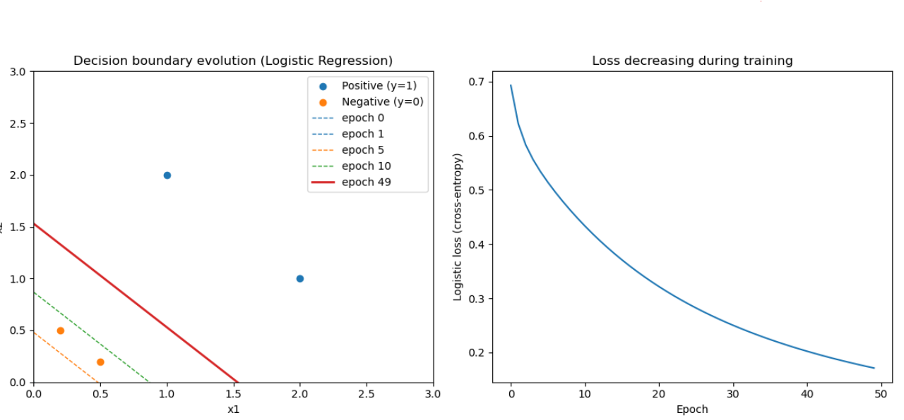

# Logistic Regression from Scratch

This project implements binary logistic regression from scratch using NumPy,
with Matplotlib used only for visualization.

The goal is to make the learning process transparent by explicitly showing
how gradient descent optimizes the model and how the decision boundary evolves
during training.

---

## Dataset

A small 2D toy dataset with four samples is manually constructed:

- Positive class (y = 1): points in the upper-right region  
- Negative class (y = 0): points near the origin  

The dataset is intentionally simple and linearly separable, allowing the
optimization dynamics to be visualized clearly.

---

## Model

The linear model computes a score: z = xW + b
which is mapped to a probability using the sigmoid function: p = sigmoid(z) = 1 / (1 + exp(-z))

---

## Loss Function

Binary cross-entropy loss is used: L = - mean( y · log(p) + (1 - y) · log(1 - p) )
A small epsilon is added to prevent numerical issues such as `log(0)`.

---

## Training

The model is trained using **batch gradient descent**.

Gradients:

dL/dw = (1/n) · Xᵀ (p - y)
dL/db = (1/n) · sum(p - y)

Parameter update:

w ← w - lr · dL/dw
b ← b - lr · dL/db

Loss and parameter values are recorded at each epoch to track convergence.

---

## Visualization

### Decision Boundary Evolution

Since the data is 2D, the linear decision boundary defined by wᵀx + b = 0

can be visualized directly.  
Snapshots from early, middle, and final training stages show how the boundary
gradually moves toward the optimal separator.

### Loss Reduction

Cross-entropy loss is plotted against training epochs, showing smooth and
stable convergence.

---

## Results

The following figure illustrates:

- Left: evolution of the decision boundary during training  
- Right: decrease of logistic loss over epochs  

---

## Tools Used

- Python  
- NumPy  
- Matplotlib  

---

## Takeaway

This project focuses on understanding rather than abstraction.
By implementing logistic regression from scratch and visualizing both the
decision boundary dynamics and loss convergence, it provides an interpretable
view of how a fundamental machine learning model learns.

